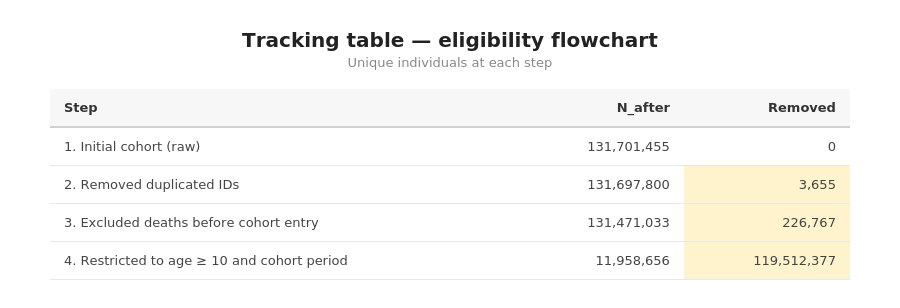

# autocodebook

Automatic codebook and eligibility tracking for data preprocessing pipelines in R.

**Write the `mutate()` — the codebook writes itself.**

Built for large-scale epidemiological and social data pipelines using [sparklyr](https://spark.rstudio.com/), but works equally well with local data frames.

## Installation

```r
devtools::install_github("patriciafortesm/autocodebook")
```

## Why autocodebook?

In data preprocessing pipelines, documenting variables is duplicated work. You already wrote the `case_when()` with all the logic — but then you have to manually write the type, the source columns, the category labels, and the code again in a separate codebook table.

**Before** (manual codebook — you write everything twice):

```r
# Step 1: Create the variable
df <- df %>%
  mutate(
    sex = case_when(
      cod_sex %in% c(0L, 99L) ~ NA_character_,
      cod_sex == 1L            ~ "Male",
      cod_sex == 2L            ~ "Female",
      TRUE                     ~ NA_character_
    )
  )

# Step 2: Manually document it (duplicated effort!)
register_var("sex",
  type       = "character",
  source     = "cod_sex",
  label      = "Sex",
  categories = "Male; Female; NA (codes 0 and 99)",
  code       = "case_when(cod_sex %in% c(0L, 99L) ~ NA_character_, ...)"
)
```

**After** (with autocodebook — you only write the label):

```r
df <- auto_mutate(df,
  labels = list(sex = "Sex"),
  sex = case_when(
    cod_sex %in% c(0L, 99L) ~ NA_character_,
    cod_sex == 1L            ~ "Male",
    cod_sex == 2L            ~ "Female",
    TRUE                     ~ NA_character_
  )
)
# Done. Type, source, categories, and code are captured automatically.
```

The package uses introspection (`rlang`) to capture the source code of each expression and infer:

| Field          | How it's inferred                                      |
|---------------|-------------------------------------------------------|
| **type**       | Keywords in the code (`NA_character_`, `0L`, `/`)     |
| **source**     | Column names referenced in the expression             |
| **categories** | Literal values extracted from `case_when` / `if_else` |
| **code**       | The literal R expression, captured automatically      |

## What you write vs. what is automatic

| Field          | Who fills it   | Example                              |
|---------------|---------------|--------------------------------------|
| **label**      | You            | `"Sex"`, `"Household crowding"`      |
| **block**      | You (optional) | `"Demographics"`, `"Migration"`      |
| **type**       | Automatic      | `"character"`, `"integer"`, `"date"` |
| **source**     | Automatic      | `"cod_sex"`, `"n_people, n_rooms"`   |
| **categories** | Automatic      | `"Male; Female; NA"`                 |
| **code**       | Automatic      | The full `case_when(...)` expression |

## Example output

Here's what the auto-generated codebook looks like — variables are grouped by block, with type, source columns, categories, and code all inferred from your expressions:


And the tracking table logs how many unique individuals remain at each pipeline step, highlighting where records are removed:



## Complete example

```r
library(dplyr)
library(autocodebook)

# ─── 1. Initialize ───────────────────────────────────────────────
cb_init(id_col = "person_id")

# ─── 2. Track baseline ──────────────────────────────────────────
track_step(df, "1. Raw data", "All records before any filter")

# ─── 3. Create variables ────────────────────────────────────────
# Just provide labels — type, source, categories, code: all automatic!

df <- auto_mutate(df,
  labels = list(
    sex      = "Sex",
    race     = "Self-declared race/ethnicity",
    crowding = "Household crowding ratio (people/rooms)"
  ),
  block = "Demographics",

  sex = case_when(
    cod_sex %in% c(0L, 99L) ~ NA_character_,
    cod_sex == 1L            ~ "Male",
    cod_sex == 2L            ~ "Female",
    TRUE                     ~ NA_character_
  ),

  race = case_when(
    cod_race == 0L ~ NA_character_,
    cod_race == 1L ~ "White",
    cod_race == 2L ~ "Black",
    cod_race == 3L ~ "Brown",
    cod_race == 5L ~ "Indigenous",
    TRUE           ~ NA_character_
  ),

  crowding = case_when(
    n_people > 0L & n_rooms > 0L ~ n_people / n_rooms,
    TRUE                         ~ NA_real_
  )
)

# ─── 4. Filter with automatic tracking ──────────────────────────
df <- auto_filter(df,
  step = "2. Remove missing sex",
  description = "Exclude records without sex information",
  !is.na(sex)
)

# ─── 5. Summarise with automatic codebook ────────────────────────
summary_df <- df %>%
  group_by(person_id) %>%
  auto_summarise(
    labels = list(
      n_records   = "Total records per individual",
      mean_income = "Mean per capita income over follow-up"
    ),
    block = "Individual summary",
    n_records   = n(),
    mean_income = mean(income, na.rm = TRUE),
    .groups = "drop"
  )

# ─── 6. View and export ─────────────────────────────────────────
cb_render()                        # Codebook as gt table in Viewer
track_render()                     # Tracking table in Viewer

cb_export("codebook.html")         # Export to HTML
cb_export("codebook.csv")          # Export to CSV (for Excel)
track_export("tracking_table.html")

# ─── 7. Programmatic access ─────────────────────────────────────
cb_get()      # Returns codebook as a tibble
track_get()   # Returns tracking log as a tibble
```

## Spark example

Works the same way with `sparklyr` — no changes needed:

```r
library(sparklyr)
library(dplyr)
library(autocodebook)

sc <- spark_connect(master = "local")
df <- copy_to(sc, my_data, "my_table")

cb_init(id_col = "person_id")
track_step(df, "1. Raw data")

df <- auto_mutate(df,
  labels = list(
    region_code = "Municipality code (7 digits)",
    state_code  = "State code (first 2 digits)"
  ),
  block = "Geographic variables",
  region_code = lpad(as.character(cod_munic), 7L, "0"),
  state_code  = substring(region_code, 1L, 2L)
)

cb_render()
spark_disconnect(sc)
```

## API reference

### Verb wrappers

| Function           | Replaces      | Registers in | Description                              |
|-------------------|--------------|-------------|------------------------------------------|
| `auto_mutate()`    | `mutate()`    | Codebook    | Creates variables + auto-documents them  |
| `auto_summarise()` | `summarise()` | Codebook    | Summarises + auto-documents new columns  |
| `auto_filter()`    | `filter()`    | Tracking    | Filters + logs how many IDs remain       |

### Codebook

| Function       | Description                                              |
|---------------|----------------------------------------------------------|
| `cb_init()`    | Initialize session and set the unique ID column          |
| `cb_register()`| Manually register a variable (for edge cases)           |
| `cb_get()`     | Returns the full codebook as a tibble                    |
| `cb_reset()`   | Clears all codebook entries                              |
| `cb_render()`  | Renders the codebook as a formatted gt table             |
| `cb_export()`  | Saves to `.html` or `.csv`                               |

### Tracking

| Function         | Description                                              |
|-----------------|----------------------------------------------------------|
| `track_step()`   | Records a step with unique ID count and removals         |
| `track_get()`    | Returns the tracking log as a tibble                     |
| `track_reset()`  | Clears the tracking log                                  |
| `track_render()` | Renders the tracking table as a formatted gt table       |
| `track_export()` | Saves to `.html` or `.csv`                               |

### Parameters for auto_mutate / auto_summarise

```r
auto_mutate(.data,
  labels = list(var1 = "Label for variable 1"),   # only required field
  block  = "Section name",                         # optional: groups in codebook
  var1   = case_when(...)                           # your normal dplyr expressions
)
```

- **`labels`**: Named list mapping variable names to descriptions. If omitted, the variable name itself is used.
- **`block`**: Optional string. Groups variables into sections in the rendered codebook (e.g., `"Demographics"`, `"Migration flags"`).

## Compatibility

- R >= 4.1
- Works with both `sparklyr` (`tbl_spark`) and local data frames
- Compatible with Spark SQL functions (`lpad`, `substring`, `lag` with `window_order`, etc.)
- No `stringr` dependency — uses only base R internally

## License

MIT
