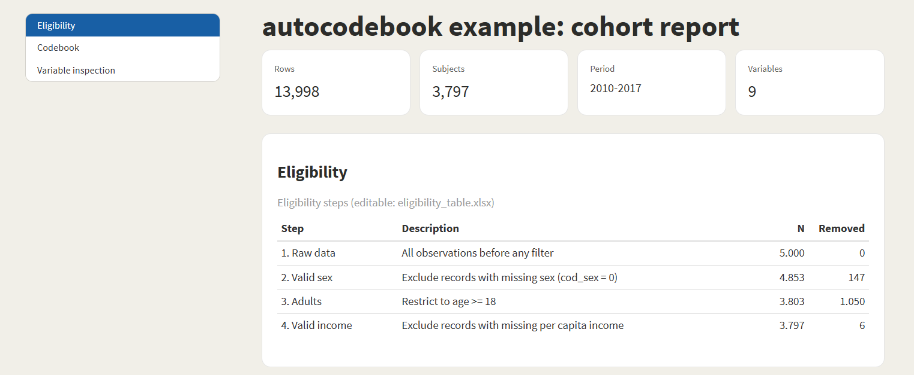
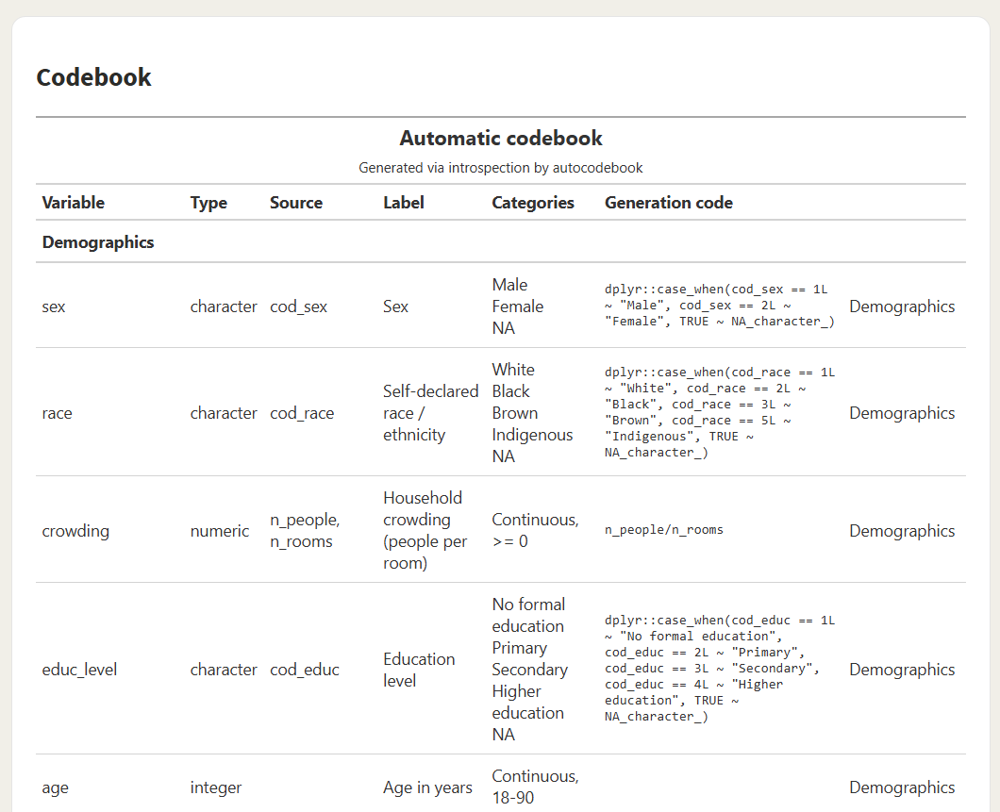
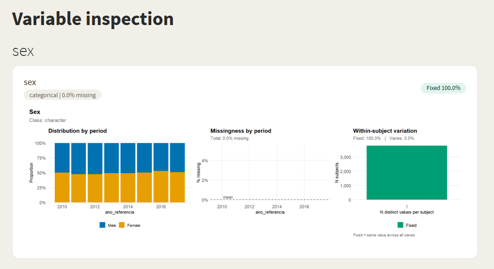
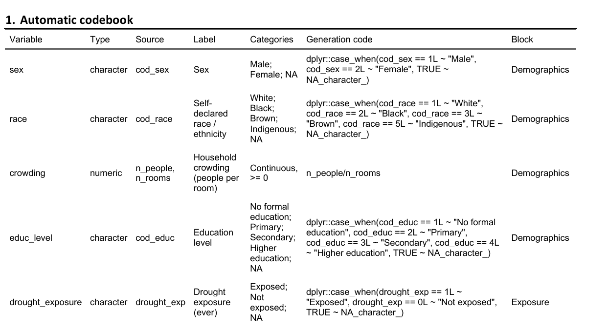
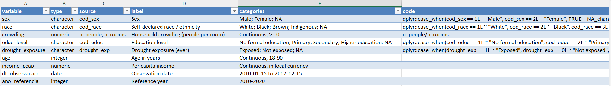
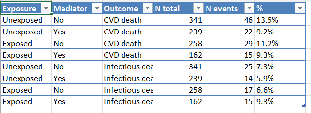

# autocodebook

Automatic codebook and eligibility tracking for data preprocessing pipelines in R.

**Write the `mutate()` — the codebook writes itself.**

Built for large-scale epidemiological and social data pipelines using
[sparklyr](https://spark.posit.co/), but works equally well with local
data frames.

## Installation

```r
# From CRAN (after release)
install.packages("autocodebook")

# Development version
# install.packages("devtools")
devtools::install_github("patriciafortesm/autocodebook")
```

## Why autocodebook?

In data preprocessing pipelines, documenting variables is **duplicated work**.
You already wrote the `case_when()` with all the logic — but then you have to
manually write the type, the source columns, the category labels, and the
code again in a separate codebook table.

**Before** (manual codebook — you write everything twice):

```r
# Step 1: Create the variable
df <- df %>%
  mutate(
    sex = case_when(
      cod_sex %in% c(0L, 99L) ~ NA_character_,
      cod_sex == 1L            ~ "Male",
      cod_sex == 2L            ~ "Female",
      TRUE                     ~ NA_character_
    )
  )

# Step 2: Manually document it (duplicated effort!)
register_var("sex",
  type       = "character",
  source     = "cod_sex",
  label      = "Sex",
  categories = "Male; Female; NA (codes 0 and 99)",
  code       = "case_when(cod_sex %in% c(0L, 99L) ~ NA_character_, ...)"
)
```

**After** (with autocodebook — you only write the label):

```r
df <- auto_mutate(df,
  labels = list(sex = "Sex"),
  sex = case_when(
    cod_sex %in% c(0L, 99L) ~ NA_character_,
    cod_sex == 1L            ~ "Male",
    cod_sex == 2L            ~ "Female",
    TRUE                     ~ NA_character_
  )
)
# Done. Type, source, categories, and code are captured automatically.
```

The package uses introspection (`rlang`) to capture the source code of each
expression and infer:

| Field        | How it's inferred                                          |
| ------------ | ---------------------------------------------------------- |
| `type`       | Keywords in the code (`NA_character_`, `0L`, `/`)          |
| `source`     | Column names referenced in the expression                  |
| `categories` | Literal values extracted from `case_when` / `if_else`      |
| `code`       | The literal R expression, captured automatically           |

### What you write vs. what is automatic

| Field        | Who fills it     | Example                                          |
| ------------ | ---------------- | ------------------------------------------------ |
| `label`      | **You**          | `"Sex"`, `"Household crowding"`                  |
| `block`      | **You** (optional) | `"Demographics"`, `"Migration"`                |
| `type`       | Automatic        | `"character"`, `"integer"`, `"date"`             |
| `source`     | Automatic        | `"cod_sex"`, `"n_people, n_rooms"`               |
| `categories` | Automatic        | `"Male; Female; NA"`                             |
| `code`       | Automatic        | The full `case_when(...)` expression             |

## Quick example

```r
library(dplyr)
library(autocodebook)

cb_init(id_col = "person_id")

df <- df %>%
  # Track raw data
  auto_filter(step = "1. Raw data", description = "All records", TRUE) %>%
  # Eligibility
  auto_filter(step = "2. Valid sex",
              description = "Exclude records with missing sex",
              !is.na(cod_sex)) %>%
  auto_filter(step = "3. Adults",
              description = "Restrict to age >= 18",
              age >= 18) %>%
  # Create derived variables (auto-documented)
  auto_mutate(
    labels = list(
      sex      = "Sex",
      race     = "Self-declared race / ethnicity",
      crowding = "Household crowding (people per room)"
    ),
    block = "Demographics",
    sex = case_when(
      cod_sex == 1L ~ "Male",
      cod_sex == 2L ~ "Female",
      TRUE          ~ NA_character_
    ),
    race = case_when(
      cod_race == 1L ~ "White",
      cod_race == 2L ~ "Black",
      cod_race == 3L ~ "Brown",
      cod_race == 5L ~ "Indigenous",
      TRUE           ~ NA_character_
    ),
    crowding = n_people / n_rooms
  )

# View and export
cb_render()                        # Codebook as gt table
cb_export("codebook.html")         # Export to HTML
cb_export("codebook.docx")         # Editable Word table
cb_export("codebook.xlsx")         # Editable Excel spreadsheet
track_render()                     # Eligibility flow as gt table

# Programmatic access
cb_get()      # Codebook as a tibble
track_get()   # Tracking log as a tibble
```

## Standardized HTML report

A single call to `generate_report()` produces a complete dashboard with
eligibility flowchart, codebook, and per-variable inspection — ready to
share with collaborators or attach as a supplement.

```r
generate_report(
  data        = df,
  type        = "longitudinal",         # or "cross_sectional"
  id_var      = "person_id",
  time_var    = "year",
  output_html = "report.html"
)
```

**Eligibility section** — automatic flowchart with N per step and number
of records removed:



**Codebook section** — all derived variables with type, source, categories,
and the exact code that produced them:



**Variable inspection** — distribution by period, missingness pattern, and
within-subject variation (Fixed vs. Varies), per variable:



## Editable exports for papers and supplements

The codebook can be exported as a fully editable Word table (for paper
supplements) or Excel spreadsheet (with filters, for review before
publication):

**Word** (`.docx`) — paste straight into supplementary material:



**Excel** (`.xlsx`) — filter, sort, edit, then re-import if needed:



## Subgroup x outcome counts (CONSORT-style data)

For studies that split the cohort by exposure (and optionally by mediator),
`track_split()` + `track_outcomes()` build a tidy tibble of N and outcome
counts at every subgroup combination. This is the **data** behind a
CONSORT-style diagram — ready for analysis, export, or as input to a
diagramming package such as
[`consort`](https://CRAN.R-project.org/package=consort) or
[`DiagrammeR`](https://CRAN.R-project.org/package=DiagrammeR).

```r
df %>%
  track_split(by = "exposure", label = "Exposure",
              value_labels = c("0" = "Unexposed", "1" = "Exposed")) %>%
  track_split(by = "mediator", label = "Mediator",
              value_labels = c("0" = "No", "1" = "Yes")) %>%
  track_outcomes(c("death_cvd", "death_infect"),
                 labels = list(death_cvd    = "CVD death",
                               death_infect = "Infectious death"))

flow_table()
```

**Output** — one row per subgroup (leaf) × outcome:



The tibble can be exported (CSV, XLSX) or piped into your preferred
plotting / diagram package. A built-in renderer for the diagram itself
is planned for a future release.

## Spark example

Works the same way with `sparklyr` — no API changes:

```r
library(sparklyr)
library(dplyr)
library(autocodebook)

sc <- spark_connect(master = "local")
df <- copy_to(sc, my_data, "my_table")

cb_init(id_col = "person_id")
track_step(df, "1. Raw data")

df <- auto_mutate(df,
  labels = list(
    region_code = "Municipality code (7 digits)",
    state_code  = "State code (first 2 digits)"
  ),
  block = "Geographic variables",
  region_code = lpad(as.character(cod_munic), 7L, "0"),
  state_code  = substring(region_code, 1L, 2L)
)

cb_render()
spark_disconnect(sc)
```

### Big-data optimizations

For large Spark pipelines, several helpers reduce wasted recomputation:

- `cb_set_default_cache(TRUE)` — caches intermediate results across the
  whole session.
- `auto_filter(..., assume_unique = TRUE)` — skips the `n_distinct(id)` call
  in tracking when the dataset is already unique by ID (orders of magnitude
  faster on multi-million-row data).
- `cb_checkpoint(sdf, mode = "memory")` — materializes a lazy `tbl_spark`
  to break long chains of transformations.
- `generate_report(..., cache_data = TRUE)` — persists the dataset once
  before computing all report aggregations.

## API reference

### Verb wrappers

| Function          | Replaces       | Registers in | Description                                            |
| ----------------- | -------------- | ------------ | ------------------------------------------------------ |
| `auto_mutate()`   | `mutate()`     | Codebook     | Creates variables + auto-documents them                |
| `auto_summarise()`| `summarise()`  | Codebook     | Summarises + auto-documents new columns                |
| `auto_filter()`   | `filter()`     | Tracking     | Filters + logs how many IDs remain                     |

### Codebook

| Function           | Description                                                    |
| ------------------ | -------------------------------------------------------------- |
| `cb_init()`        | Initialize session and set the unique ID column                |
| `cb_register()`    | Manually register a variable (for edge cases)                  |
| `cb_get()`         | Returns the full codebook as a tibble                          |
| `cb_reset()`       | Clears all codebook entries                                    |
| `cb_render()`      | Renders the codebook as a formatted `gt` table                 |
| `cb_export()`      | Saves to `.html`, `.csv`, `.docx`, or `.xlsx`                  |

### Eligibility tracking

| Function           | Description                                                    |
| ------------------ | -------------------------------------------------------------- |
| `track_step()`     | Records a step with unique ID count and number removed         |
| `track_get()`      | Returns the tracking log as a tibble                           |
| `track_reset()`    | Clears the tracking log                                        |
| `track_render()`   | Renders the tracking table as a formatted `gt` table           |
| `track_export()`   | Saves to `.html`, `.csv`, `.docx`, or `.xlsx`                  |

### Flow tree (CONSORT-style)

| Function           | Description                                                    |
| ------------------ | -------------------------------------------------------------- |
| `track_split()`    | Adds a branching level (e.g., by exposure)                     |
| `track_outcomes()` | Stacks outcome counts on the current leaves                    |
| `flow_table()`     | Tidy tibble with one row per leaf x outcome                    |
| `flow_get()`       | Returns the raw flow-tree structure as a list                  |
| `flow_reset()`     | Clears the flow tree                                           |

### Reports and session options

| Function                  | Description                                              |
| ------------------------- | -------------------------------------------------------- |
| `generate_report()`       | Builds the full HTML dashboard (+ editable exports)      |
| `cb_checkpoint()`         | Materializes a lazy `tbl_spark`                          |
| `cb_set_verbose()`        | Toggles diagnostic messages                              |
| `cb_set_default_cache()`  | Sets the session-wide default for `cache`                |

## Parameters for auto_mutate / auto_summarise

```r
auto_mutate(.data,
  labels = list(var1 = "Label for variable 1"),  # only required field
  block  = "Section name",                        # optional: groups in codebook
  var1   = case_when(...)                          # your normal dplyr expressions
)
```

- **`labels`**: Named list mapping variable names to descriptions. If
  omitted, the variable name itself is used.
- **`block`**: Optional string. Groups variables into sections in the
  rendered codebook (e.g., `"Demographics"`, `"Migration flags"`).

## Compatibility

- R >= 4.1
- Works with both `sparklyr` (`tbl_spark`) and local data frames
- Compatible with Spark SQL functions (`lpad`, `substring`, `lag` with
  `window_order`, etc.)
- No `stringr` dependency — uses only base R internally
- Report exports require `rmarkdown`, `ggplot2`, `patchwork`, `scales`
  (Suggests)
- Editable exports to `.docx` / `.xlsx` require `officer`, `flextable`,
  `openxlsx` (Suggests)

## License

MIT
